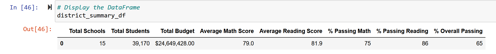
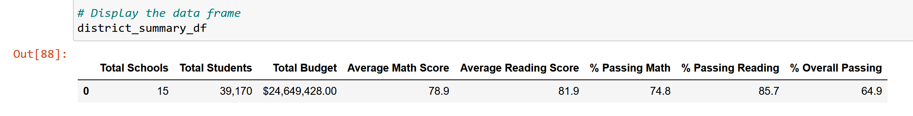

# School_District_Analysis

## Overview of Project: 
After the completion of the School District Analysis, evidence of academic dishonesty; specifically, the reading and math grades for Thomas High School ninth graders appear to have been altered. Although the school board does not know the full extent of the academic dishonesty, they want to uphold state-testing standards. Hence, the math and reading scores for the ninth graders at Thomas High School will be replaced with NaNs at this time.  Then, the analysis will be completed again. 

### Purpose: 
To find out what changes will occur to the overall school district analysis when the reading and math grades for the entire 9th grade class at Thomas High School are not calculated. 

## Results

- How is the district summary affeacted?
Evidenced by the below pictures, the overall scores were only lowered .1%

Original District Summary:

District Summary missing the 9th grade math and reading results:

- How is the school summary affected?

### Summary

